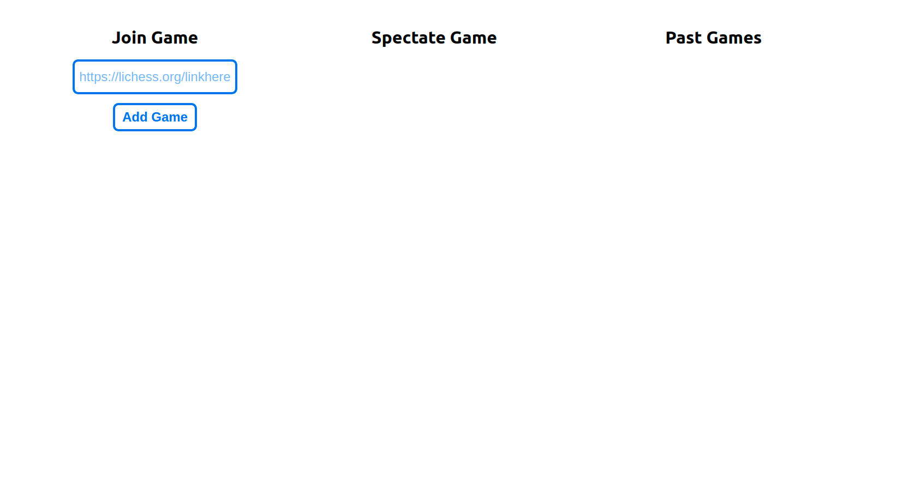
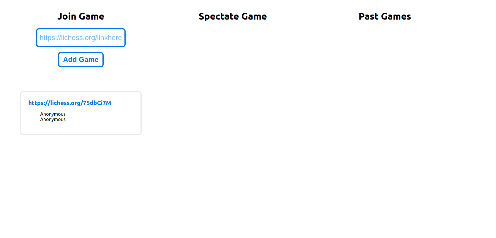
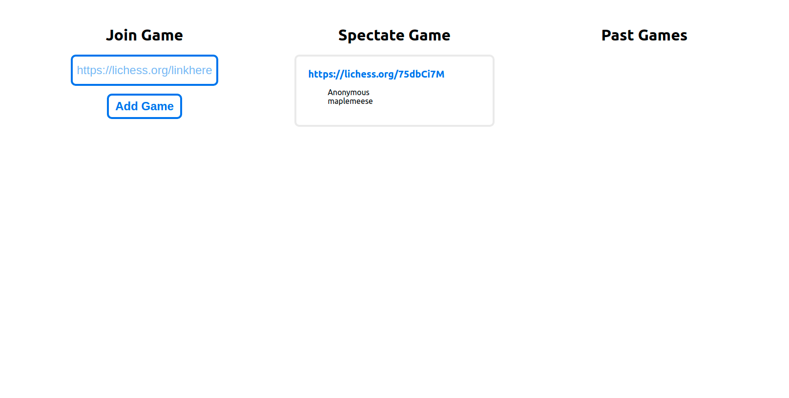

# chess dashboard for online chess club
Socket.io powered dashboard for online school chess club. Allows users to share lichess links. Backend uses Lichess API to check game status and displays them accordingly.





## Requirements
- [Next.js](https://nextjs.org/)
- [Socket.io](https://socket.io/)

## Getting Started
```bash
npm run dev
# or
yarn dev
```


